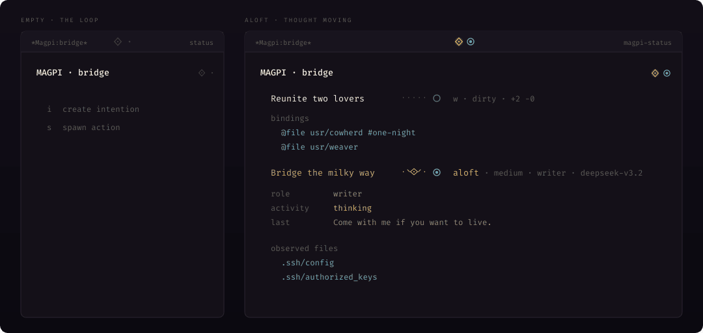

# Magpi

State your why. Bind the context that matters. Spawn an action. Interact. React.

Magpi holds the why beside Pi's doing and Git's evidence. Tiny Emacs porcelain over Git, Magit, Pimacs, and Pi.

<table>
<tr>
  <td align="center" valign="middle" width="18%">
    
  </td>
  <td align="center" valign="middle" width="82%">
    
  </td>
</tr>
</table>

## How to

`C-c m m` opens Magpi status. `C-c m i` and `C-c m @` work anywhere.

| | Key | Meaning |
|---|-----|---------|
| author | `i` | create an intention |
| | `s` | spawn an action |
| | `@` | bind context at point |
| glance | `TAB` | fold |
| | `n` / `p` | next / previous last-seen chat |
| | `j` | Perch ↔ Cold |
| | `g` | reconcile and repaint |
| judge | `RET` | intention → Magit; action → chat; ask → React |
| | `v` | live writer → garden; idle exclusive writer occupies source |
| | `a` | React |
| | `k` | discard chat / action / intention / worktree at point |
| depth | `m` `d` `l` `c` | Magit status, diff, log, commit |

## Symbols

| Mark | Meaning |
|------|---------|
| `?` | pending ask |
| `!` | disconnection |
| `w` | writer lease |

Launch defaults to writer; press `w` on spawn for reader (`r`). `W` takes an
exclusive writer lease; without it several writers may share an intention.
Our defaults are explicit intent you author the task as the first message.

## Install

Magpi does not replace its priors. It is porcelain over them, as Magit is over Git.

| Prior | Owns | Magpi |
|-------|------|-------|
| Emacs 29.1 | point, buffers, `project.el` | bind, status, `C-c m` |
| Git | objects, worktrees, branches | identity; missing stays missing |
| [Magit](https://magit.vc) | diff, stage, log, commit, `magit-section` | glance in Magit-mode; depth stays Magit |
| [Pimacs](https://github.com/ananthakumaran/pimacs.el) | chat, Pi session, protocol | one adapter |
| [Pi](https://pi.dev) | the agent | spawn, observe, react to asks |

`Package-Requires` is Emacs, Magit, and Pimacs.
Magit pulls dependencies like Transient and `magit-section` for us.

Emacs 29 can fetch Magpi from source:

```elisp
(package-vc-install
 '(magpi :url "https://github.com/ks0m1c/magpi"
         :lisp-dir "emacs"))
(require 'magpi)
```

`C-c m` is bound from Magpi's autoloads.

## Contributing

Clone this repo, then from the root:

```sh
make test          # unit + seams
make test-unit     # no Magit package tree
make test-seams    # real Magit + Transient
make compile       # byte-compile Magpi; print warnings
make xref          # unused symbols, unbound commands, isolation
make instrument    # compile + xref
```

## Design Spec

The motivations, invariants, code organisation, composition, and build order live in
[`specs/MAGPI.org`](specs/MAGPI.org).
